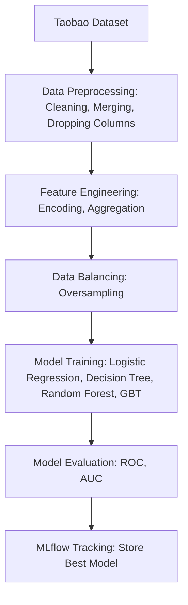
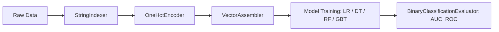

# Ads Click-Through-Rate (CTR) Prediction using Spark MLlib

### Big Data Analytics Project  
**Group Members:** Ravjot Singh, Rudra Suthar, Rajiv Ranjan  

---

## Overview
This project predicts whether a user will click on an online advertisement (CTR prediction) using the **Taobao / Alimama** dataset.  
It leverages **Apache Spark MLlib** for distributed data processing and machine learning model training.

---

## Tech Stack
- Apache Spark (PySpark MLlib) — scalable data processing and ML
- MLflow — experiment tracking and model logging
- Matplotlib — evaluation visualization (ROC curve)
- Python 3.8+

---

## Workflow

## Dataset

**Description:**

-   Contains user behavior logs, ad metadata, and click labels
    
-   Key features: user ID, ad ID, campaign ID, category ID, brand ID, and `clk` (click label)
## Model Pipeline

## Execution Steps

1.  Load and merge CSV data from Taobao dataset
    
2.  Clean and preprocess data (drop irrelevant or null-heavy columns)
    
3.  Feature engineer categorical columns with one-hot encoding and numeric aggregations
    
4.  Handle class imbalance with oversampling
    
5.  Train and evaluate models (AUC / ROC)
    
6.  Log results and best model using MLflow

## Model Performance

| Model                  | Metric  | AUC Score |
| :--------------------- | :------ | :-------- |
| Logistic Regression    | ROC-AUC | ~0.78     |
| Decision Tree          | ROC-AUC | ~0.74     |
| Random Forest          | ROC-AUC | ~0.82     |
| Gradient Boosted Trees | ROC-AUC | ~0.85     |
